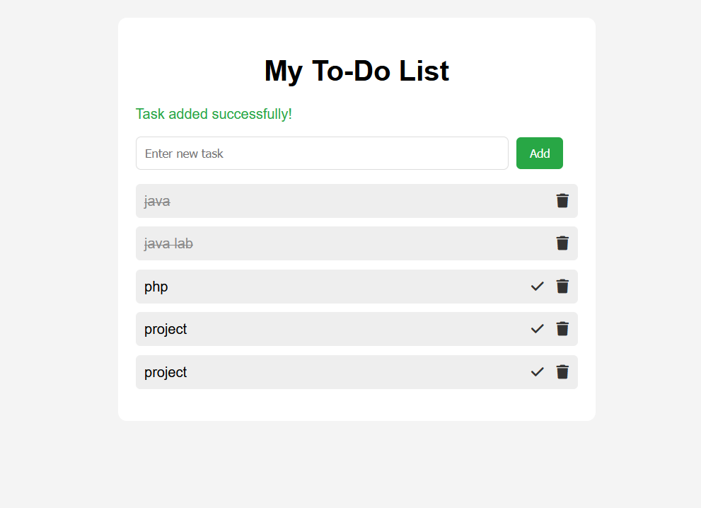

# ✅ Laravel To-Do App

A simple and clean **To-Do List application** built using **Laravel**, **PHP**, and **MySQL**.  
This project demonstrates CRUD operations (Create, Read, Update, Delete).

---

## 🚀 Features
- Add new tasks
- Mark tasks as completed
- Delete tasks
- Responsive design

---

## 🛠️ Tech Stack
- **Backend:** PHP 8, Laravel 10
- **Frontend:** Blade Templates, Bootstrap
- **Database:** MySQL
- **Version Control:** Git & GitHub

---

## 📸 Screenshots

### Front Page


---

## 📂 Installation

1. **Clone the repository**
   ```bash
   git clone https://github.com/dascode0/todo-app
   cd to-do
